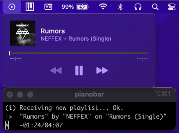
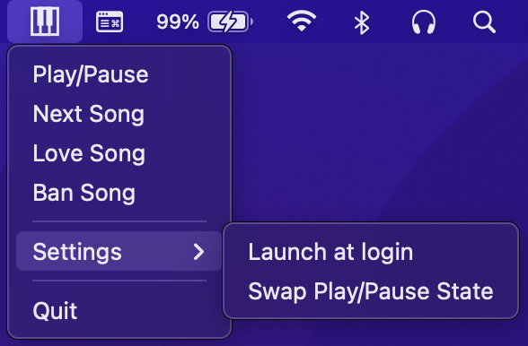

# PianobarNowPlayable - Integrate Pianobar with the Now Playing feature of macOS

Ever wanted to control [Pianobar](https://github.com/PromyLOPh/pianobar) like you do most other music applications on
macOS? So did I! Introducing, PianobarNowPlayable!



PianobarNowPlayable runs in the menu bar and operates silently in the background, facilitating communication between
Pianobar and macOS. You can find a few controls and settings if you click the icon (looks like the keys of a piano).
These include some extra controls for pianobar (loving and banning songs), an option to launch at startup, and a way to
swap the play pause button if it gets confused.



A big thanks to the creator of [PianoKeys](https://github.com/shayne/PianoKeys). That app is what inspired me to create
this one after it went unmaintained.

## Features

- Control Pianobar using the media keys from your keyboard or headphones
- See the currently playing song from the Now Playing menu bar icon
- Love or Ban songs from PianobarNowPlayable's menu bar icon
- Automatically start PianobarNowPlayable with macOS

## Setup and Installation

1. Clone or download the repo
2. Build the project with Xcode and move the app to wherever you want it
3. Create the named pipe so PianobarNowPlayable can communicate with Pianobar
    ```bash
    mkfifo ~/.config/pianobar/ctl
    ```
4. Copy the event command handler so Pianobar can communicate with PianobarNowPlayable
    ```bash
    cp pianobarNowPlayableEventCommand ~/.config/pianobar/
    ```
5. Add these two lines to your pianobar config
   ```
   fifo = ~/.config/pianobar/ctl
   event_command = ~/.config/pianobar/pianobarNowPlayableEventCommand
   ```
6. Run PianobarNowPlayable
7. Run Pianobar

## Known Issues

- Only the default Pianobar key bindings for controls are supported right now
- Play pause button state may be incorrect until the song switches
- Interruptions like FaceTime and phone calls can play or pause Pianobar incorrectly
- There is no playback information reported to the Now Playing widget

## Contributing

I work on PianobarNowPlayable in my free time outside of work. If you come up with an idea, have questions, or found a
bug, feel free to open up an issue. I'll respond when I have a chance. If you add a feature or fix an issue, please open
up a PR! So long as the change looks good and works, I'd be happy to merge it in.
